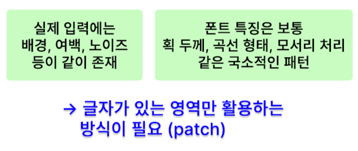
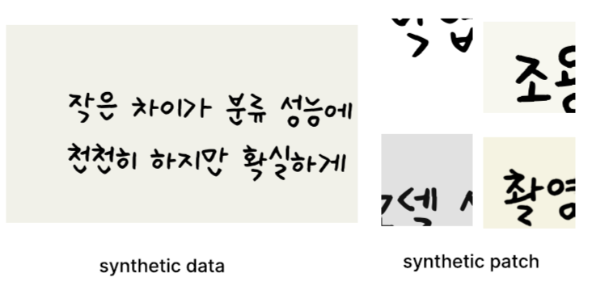
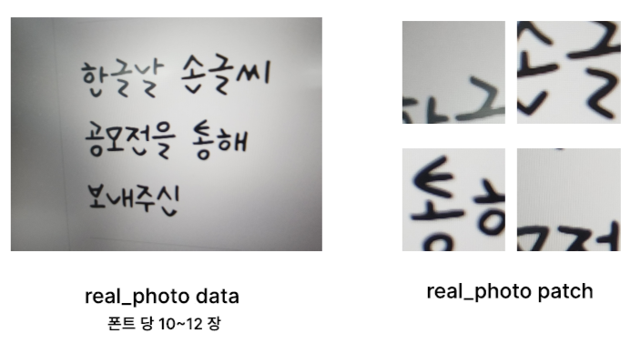
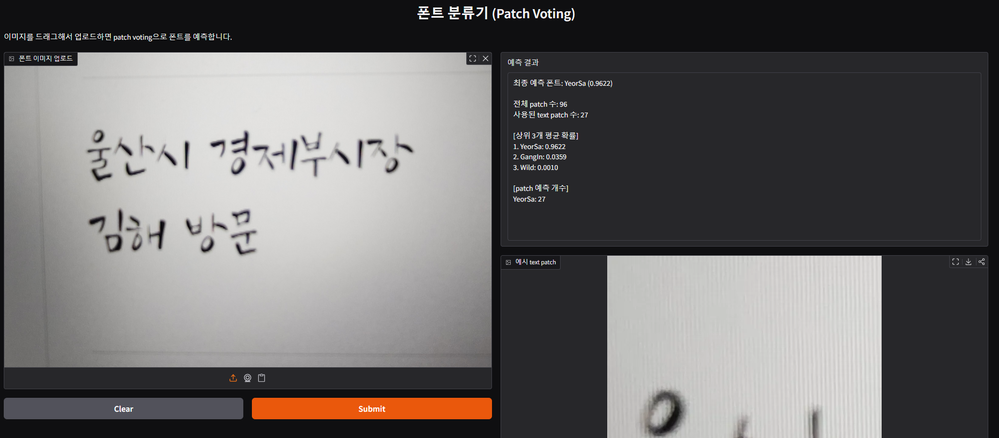

# Font Classification Vision

문서 이미지에서 8종 폰트를 분류하기 위한 Computer Vision 프로젝트입니다. ResNet18 기반 분류 모델을 사용했고, 실제 이미지 데이터 부족 문제를 보완하기 위해 Synthetic 데이터와 Real 데이터를 함께 구성했습니다. 또한 전체 이미지를 한 번에 분류하는 대신, 문서 이미지를 patch 단위로 나눈 뒤 예측 결과를 종합하는 Patch Voting 방식을 적용했습니다.

## 문제 정의

문서 전체 이미지를 한 번에 분류하면 배경, 여백, 노이즈, 글자 크기, 촬영 각도 같은 요소 때문에 폰트 특징이 약해질 수 있습니다. 이 프로젝트는 글자가 포함된 patch를 추출하고, patch 단위 예측 결과를 종합해 최종 폰트를 더 안정적으로 판단하는 것을 목표로 했습니다.



## 주요 기능

- 8종 폰트 분류 task 정의
- Synthetic font image 생성 및 학습 데이터 구성
- Real document image에서 text patch 추출
- Synthetic / Real patch dataset 병합
- ImageNet pretrained ResNet18 fine-tuning
- patch-level prediction 결과를 majority voting으로 통합
- Gradio 기반 demo app 구성

## 데이터 구성

### Synthetic Patch



### Real Patch



실제 이미지 데이터가 부족한 문제를 보완하기 위해 Synthetic : Real 비율을 약 4:1로 구성해 학습했습니다.

## Demo



## 결과

### Confusion Matrix


### Class Metrics


주요 성능:

- validation accuracy: 약 96.5%
- 별도 real64 테스트셋 accuracy: 1.0

## 담당 역할

- ResNet18 기반 8종 폰트 분류 모델 선정 및 학습
- 실제 이미지 데이터 부족 문제를 보완하기 위한 Synthetic / Real 데이터 구성
- Synthetic : Real 약 4:1 비율의 학습 데이터 구성
- 문서 이미지에서 text patch를 추출하고 filtering하는 전처리 logic 구현
- patch 단위 예측 결과를 image-level result로 통합하는 Patch Voting 방식 적용
- 학습/검증 결과 비교 및 성능 확인

## Tech Stack

- Python
- PyTorch
- Torchvision ResNet18
- OpenCV
- PIL
- Gradio

## Project Structure

```text
.
├── app/
│   └── app.py
├── src/
│   ├── data/
│   │   ├── make_synthetic_dataset.py
│   │   ├── make_synthetic_patch_dataset.py
│   │   ├── make_real_patch_dataset.py
│   │   └── make_merged_patch_dataset.py
│   ├── train/
│   │   └── train_resnet18.py
│   └── eval/
│       └── evaluate_patch_voting.py
├── results/
├── docs/
└── requirements.txt
```

## 핵심 아이디어

| 단계 | 설명 |
| --- | --- |
| 데이터 생성 | TTF font를 이용해 synthetic text image 생성 |
| Patch 추출 | 문서 이미지를 일정 크기의 patch로 분할 |
| Text patch filtering | 밝기, edge ratio, connected component 조건으로 text patch 선별 |
| 학습 | ResNet18 classifier fine-tuning |
| 추론 | patch별 예측 결과를 voting해 최종 font 결정 |

## Quick Start

모델 checkpoint는 공개 저장소에 포함하지 않았습니다. Demo를 실행하려면 checkpoint를 아래 위치에 배치해야 합니다.

```text
app/models/checkpoints/resnet18_font_cls_best_v2.pth
```

환경 설치 후 Gradio demo를 실행합니다.

```bash
pip install -r requirements.txt
python app/app.py
```

학습을 다시 수행하려면 dataset을 준비한 뒤 아래 스크립트를 실행합니다.

```bash
python src/train/train_resnet18.py
```

## Repository Scope

포함 항목:

- 학습 코드
- 추론/demo 코드
- 데이터 생성 script
- Patch Voting 평가 코드
- 결과 chart
- README용 결과 이미지

제외 항목:

- 가상환경
- 생성 dataset
- TTF font file
- model checkpoint
- 최종 발표자료와 원본 real/synthetic image dataset

모델 checkpoint를 공개할 경우 font license와 dataset 공개 가능 범위를 먼저 확인하고, 대용량 파일은 Git LFS 또는 GitHub Release로 관리하는 것이 적절합니다.
