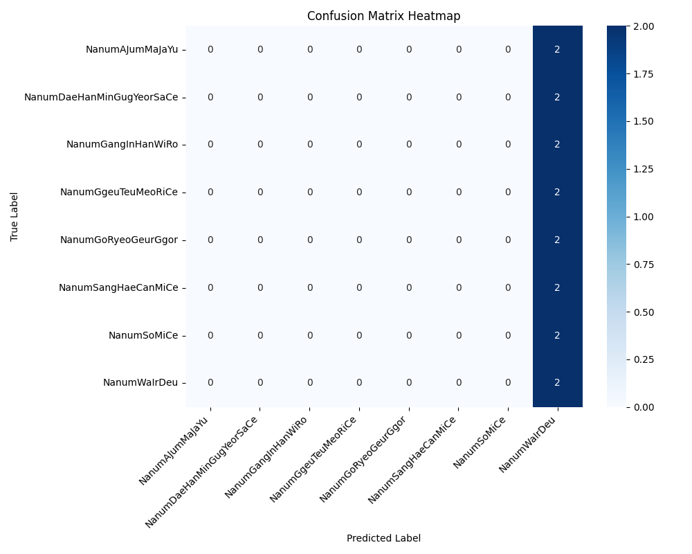
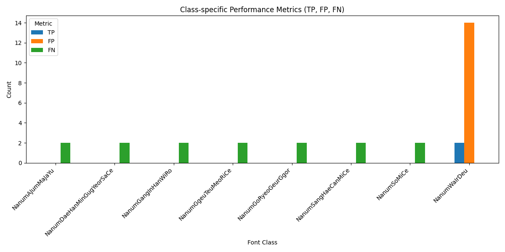

# Font Classification Vision

문서 이미지에서 8종 폰트를 분류하기 위한 Computer Vision 프로젝트입니다. ResNet18 기반 분류 모델을 사용했고, 부족한 실제 이미지 데이터를 보완하기 위해 Synthetic 데이터와 Real 데이터를 함께 구성했습니다. 또한 이미지 전체를 한 번에 분류하는 방식뿐 아니라, 문서 이미지를 patch 단위로 나눈 뒤 예측 결과를 종합하는 Patch Voting 방식을 적용했습니다.

## 문제 정의

문서 전체 이미지를 한 번에 분류하면 배경, 여백, 이미지 품질, 글자 크기, 글자 밀도 차이 때문에 폰트 특징이 약해질 수 있습니다. 이 프로젝트는 문서 이미지에서 텍스트가 포함된 patch를 추출하고, patch 단위 예측 결과를 종합해 더 안정적으로 최종 폰트를 판단하는 것을 목표로 했습니다.

## 주요 기능

- 8종 폰트 분류 task 정의
- Synthetic font image 생성 및 학습 데이터 구성
- Real document image에서 text patch 추출
- Synthetic / Real patch dataset 병합
- ImageNet pretrained ResNet18 fine-tuning
- Patch-level prediction 결과를 majority voting으로 통합
- Gradio 기반 demo app 구성

## My Contribution

- ResNet18 기반 8종 폰트 분류 모델 선정 및 학습
- 실제 이미지 데이터 부족 문제를 보완하기 위해 Synthetic 데이터와 Real 데이터를 결합해 학습 데이터 구성
- Synthetic : Real 비율을 약 4:1로 구성해 학습 데이터 다양성 확보
- 문서 이미지에서 text patch를 추출하고 filtering하는 전처리 logic 구현
- Patch 단위 예측 결과를 image-level result로 통합하는 Patch Voting 방식 적용
- 학습/검증 결과를 비교하며 모델 성능 확인
- 최종적으로 validation accuracy 약 96.5%, real64 데이터 기준 accuracy 1.0 수준 확인

## 결과 이미지

### Confusion Matrix



### Class Metrics



## Tech Stack

- Python
- PyTorch
- Torchvision ResNet18
- OpenCV
- PIL
- Gradio

## 프로젝트 구조

```text
.
├─ app
│  └─ app.py
├─ src
│  ├─ data
│  │  ├─ make_synthetic_dataset.py
│  │  ├─ make_synthetic_patch_dataset.py
│  │  ├─ make_real_patch_dataset.py
│  │  └─ make_merged_patch_dataset.py
│  ├─ train
│  │  └─ train_resnet18.py
│  └─ eval
│     └─ evaluate_patch_voting.py
├─ results
│  ├─ class_metrics_bar_chart.png
│  └─ confusion_matrix_heatmap.png
├─ docs
└─ requirements.txt
```

## 핵심 아이디어

| 단계 | 설명 |
| --- | --- |
| 데이터 생성 | TTF font를 이용해 synthetic text image 생성 |
| Patch 추출 | 문서 이미지를 일정 크기의 patch로 분할 |
| Text patch filtering | 밝기, edge ratio, connected component 조건으로 텍스트 patch 선별 |
| 학습 | ResNet18 classifier fine-tuning |
| 추론 | patch별 예측 결과를 voting해 최종 font 결정 |

## Quick Start

```bash
pip install -r requirements.txt
python app/app.py
```

학습을 다시 수행하려면 dataset을 준비한 뒤 아래 스크립트를 실행합니다.

```bash
python src/train/train_resnet18.py
```

## Repository Scope

포함한 항목:

- 학습 코드
- 추론/demo 코드
- 데이터 생성 script
- Patch Voting 평가 코드
- 결과 chart
- 프로젝트 문서

제외한 항목:

- 가상환경
- 생성된 dataset
- TTF font file
- model checkpoint

모델 checkpoint를 공개할 경우 font license와 dataset 공개 가능 범위를 먼저 확인하고, 대용량 파일은 Git LFS로 관리하는 것이 좋습니다.
